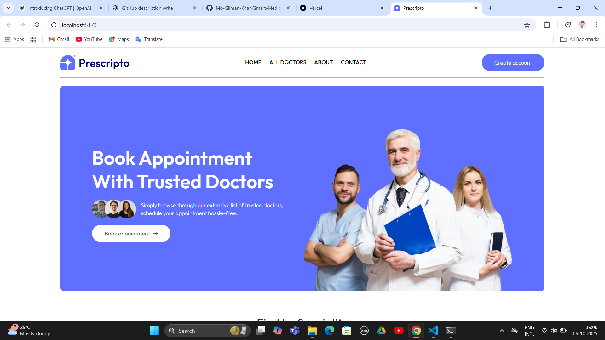
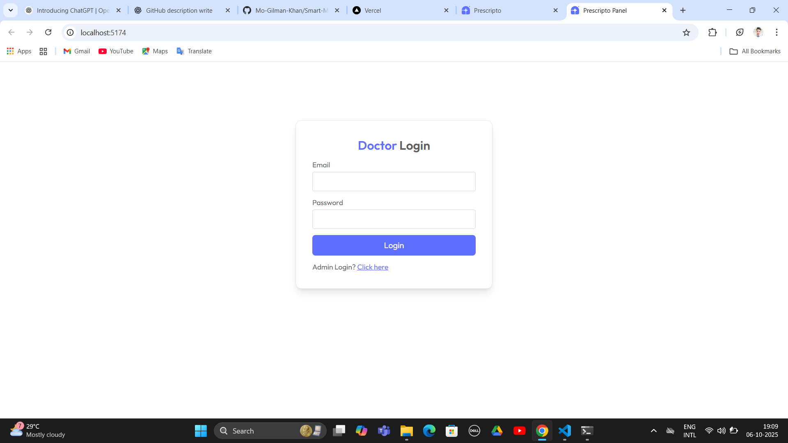
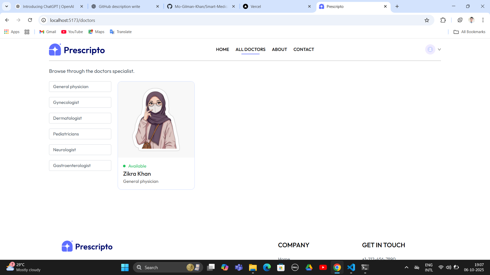

# About the Project

The **Smart Medical Appointment Booking System** is a web application built using the **MERN stack** (MongoDB, Express.js, React + Vite, Node.js).  
It simplifies the process of scheduling medical appointments online — providing **patients**, **doctors**, and **administrators** with an intuitive and secure interface for booking and managing appointments efficiently.


## Features

- **Role-based Access:** Separate dashboards for Patients, Doctors, and Admins  
- **Real-Time Scheduling:** Appointment booking with live doctor availability  
- **Notifications:** Email or SMS alerts for booking updates  
- **Doctor Search:** Filter by specialization, location, or availability  
- **Medical History:** Secure storage of past appointments and records  
- **Authentication:** JWT-based login and authorization  
- **Admin Panel:** Manage users, doctors, and appointments  

---

## Screenshots

| **Login / Signup** |  |
| **doctor login** |  |
| **Doctor Dashboard** |  |
| **Admin Panel** |  |


---

## Project Structure

smart-medical-appointment/
├── backend/
│ ├── controllers/
│ ├── middleware/
│ ├── models/
│ ├── routes/
│ ├── utils/
│ └── server.js
├── frontend/
│ ├── public/
│ ├── src/
│ │ ├── components/
│ │ ├── pages/
│ │ ├── redux/
│ │ ├── App.jsx
│ │ └── main.jsx
│ ├── vite.config.js
│ └── package.json
├── .gitignore
├── README.md
└── LICENSE


## Tech Stack

| **Frontend** | React.js (Vite), Redux Toolkit, Tailwind CSS / Material UI |
| **Backend** | Node.js, Express.js |
| **Database** | MongoDB with Mongoose |
| **Authentication** | JWT, bcrypt.js |
| **Notifications** | Nodemailer / Twilio |
| **File Uploads** | Cloudinary |
| **Deployment** | Vercel |

---

### Installation & Setup

## Clone the Repository
```bash
git clone https://github.com/Mo-Gilman-Khan/Smart-Medical-Appoinment-Booking-System-Using-MERN.git
cd Smart-Medical-Appoinment-Booking-System-Using-MERN

### Backend Setup
bash
Copy code
cd backend
npm install

### Create a .env file in the backend folder:
env
Copy code
PORT=5000
MONGO_URI=your_mongodb_uri
JWT_SECRET=your_secret_key
CLOUDINARY_NAME=your_cloudinary_name
CLOUDINARY_API_KEY=your_api_key
CLOUDINARY_API_SECRET=your_api_secret
EMAIL_USER=your_email
EMAIL_PASS=your_email_password
Start the backend server:

bash
Copy code
npm run dev

### 3️ Frontend Setup (Vite + React)
bash
Copy code
cd ../frontend
npm install
npm run dev
The app will start at:

Frontend: http://localhost:5173

Backend API: http://localhost:5000

### Usage
Register or log in as Patient, Doctor, or Admin

Patients can search doctors and book appointments

Doctors can view and manage upcoming appointments

Admin can manage users, doctors, and appointments

Receive confirmation emails or SMS notifications automatically

### Future Enhancements
- AI-based doctor recommendation

- Online payment integration (Stripe / Razorpay)

- React Native mobile app

- Integration with wearable health devices

### Contributing
Contributions are always welcome!

Fork this repository

Create a new branch (git checkout -b feature-name)

Commit your changes (git commit -m "Added new feature")

Push to your fork (git push origin feature-name)

Open a Pull Request

### License
This project is licensed under the MIT License — see the LICENSE file for details.

### Author
Developer: Mo Gilman Khan
GitHub: @Mo-Gilman-Khan
Email: gilman2026@gmail.com

